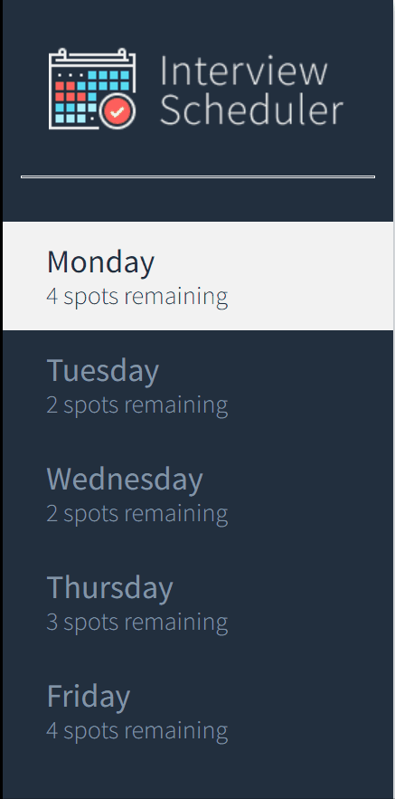
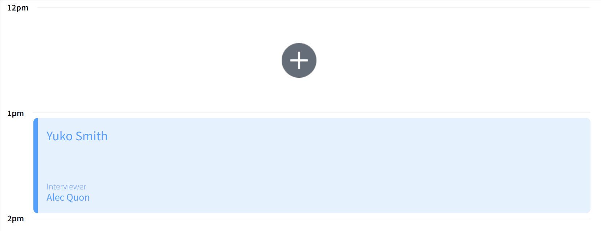

# Interview Scheduler
A single-page React application that allows users to book and cancel interviews.

Scheduler was built with React, JavaScript, Webpack, and NodeJS and tested with Storybook, Jest, and Cypress.

## Purpose
**_BEWARE_: This app was created for learning purposes. It is not intended for use in production-grade software.**

This project was created and published by Lisa Meyer as part of my learnings at Lighthouse Labs.

## Scheduler in Action
Scheduler has a pleasing user interface that easily displays the day and number of available appointments.
Available appointments update without requiring a page refresh.



Easily add, edit, or delete an appointment.



Forget something? Not with Scheduler!


## Using Scheduler

### Setup

```sh
git clone https://github.com/l-m-meyer/scheduler
cd scheduler
npm i
```

### Running Webpack Development Server

```sh
npm start
```

### Running Jest Test Framework

```sh
npm test
```

### Running Storybook Visual Testbed

```sh
npm run storybook
```
## Development

### Dependencies
* axios
* classnames
* react
* react-dom
* react-scripts

### Development Dependencies
* storybook
* cypress
* react-test-renderer
* @testing-library/react
* @testing-library/react-hooks
* @testing-library/jest-dom
* webpack
* babel
